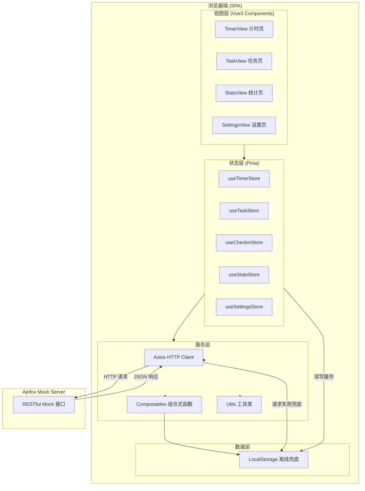
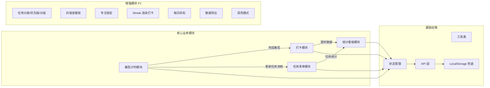
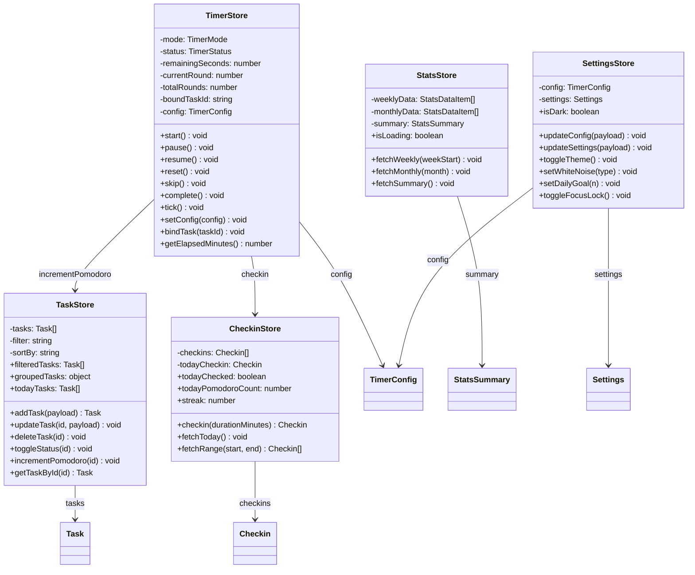
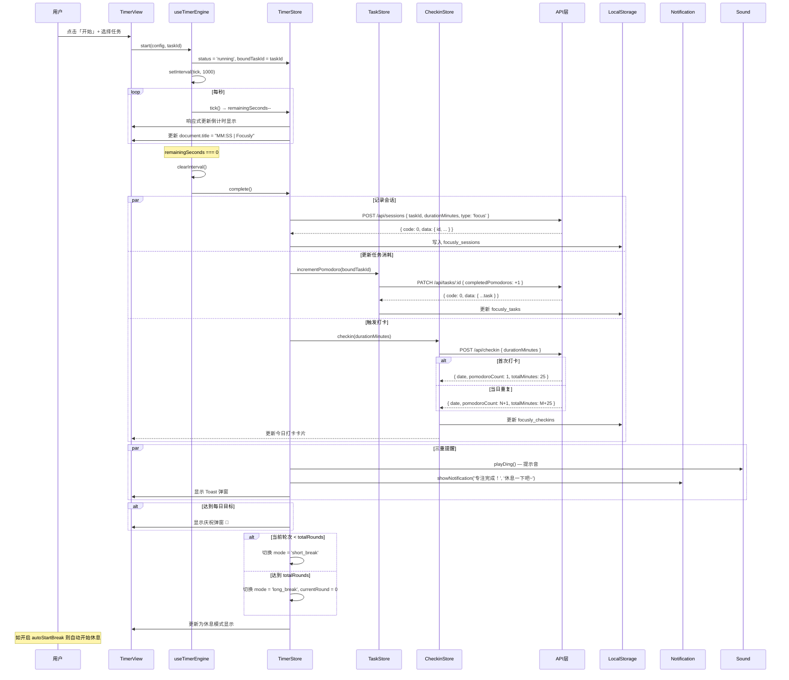
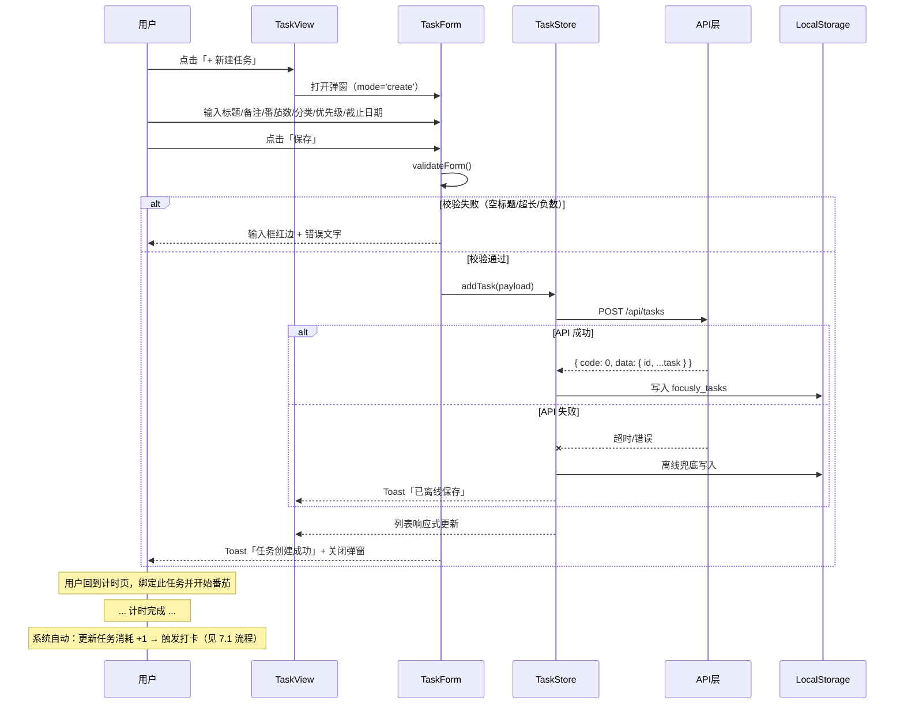
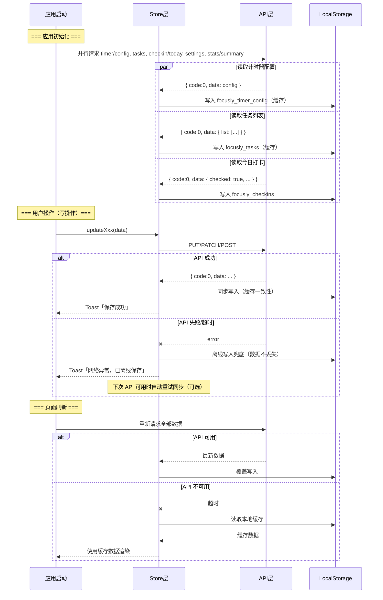
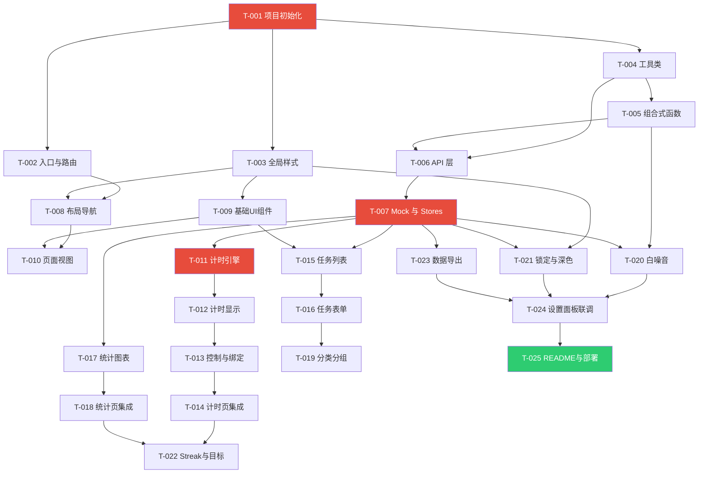

# Focusly 番茄时钟 - 系统架构设计文档

> 文档版本：v1.0  
> 编写人：架构师 高见远  
> 编写日期：2026-08-20  
> 关联文档：[PRD.md](./PRD.md)

---

## 目录

1. [实现方案](#1-实现方案)
2. [框架与依赖](#2-框架与依赖)
3. [文件结构](#3-文件结构)
4. [数据结构定义](#4-数据结构定义)
5. [状态管理（Pinia Stores）](#5-状态管理pinia-stores)
6. [API 设计（Mock RESTful）](#6-api-设计mock-restful)
7. [核心流程时序图](#7-核心流程时序图)
8. [任务列表](#8-任务列表)
9. [共享约定](#9-共享约定)
10. [待明确事项](#10-待明确事项)

---

## 1. 实现方案

### 1.1 整体架构图



### 1.2 技术选型理由

| 技术 | 版本 | 选型理由 |
|------|------|----------|
| **Vue 3** | ^3.4.21 | PRD指定框架；Composition API 逻辑复用性强，`<script setup>` 语法糖减少样板代码；响应式系统轻量高效 |
| **Vite** | ^5.2.0 | PRD指定构建工具；ESM 原生开发服务器启动 <1s；HMR 极快；Rollup 打包产物体积小，适合轻量化 SPA |
| **Pinia** | ^2.1.7 | Vue 3 官方推荐状态管理；API 简洁（无 mutations）；TypeScript 友好；模块化 store 天然适配多模块设计；体积仅 ~1KB |
| **Vue Router** | ^4.3.0 | SPA 路由标配；支持懒加载优化首屏；hash 模式适配 GitHub Pages 部署 |
| **Axios** | ^1.6.8 | PRD指定；拦截器机制完善，统一处理 token/错误/loading；请求取消避免定时器叠加导致的重复请求 |
| **ECharts** | ^5.5.0 | PRD指定；柱状图/饼图 API 成熟；按需引入减小体积；响应式 resize 方便 |
| **vite-plugin-mock** | ^3.0.2 | 本地开发 Mock，与 Apifox Mock 接口定义保持一致；无需额外启动 Mock 服务即可调试 |
| **mockjs** | ^1.1.0 | 配合 vite-plugin-mock 生成随机 Mock 数据 |

### 1.3 模块划分



### 1.4 架构模式

采用 **分层架构 + Composition API** 模式：

```
View（视图） → Store（状态） → Service（API/Composable） → Data（LocalStorage）
```

- **单向数据流**：视图只通过 Store 读写数据，Store 调用 API 层，API 层负责 HTTP 与 LocalStorage 兜底
- **Composition 复用**：计时引擎、通知、声音等横切关注点抽取为 Composable，跨组件复用
- **Store 隔离**：每个业务域一个 Store，避免耦合；Store 间通过显式方法调用协作（如 Timer 完成 → 调 Task/Checkin Store）

---

## 2. 框架与依赖

### 2.1 package.json 依赖列表

```json
{
  "name": "focusly-pomodoro-timer",
  "version": "1.0.0",
  "description": "Focusly 番茄时钟 - 专注学习打卡工具",
  "type": "module",
  "scripts": {
    "dev": "vite",
    "build": "vite build",
    "preview": "vite preview",
    "mock": "vite --mode mock"
  },
  "dependencies": {
    "vue": "^3.4.21",
    "vue-router": "^4.3.0",
    "pinia": "^2.1.7",
    "axios": "^1.6.8",
    "echarts": "^5.5.0"
  },
  "devDependencies": {
    "@vitejs/plugin-vue": "^5.0.4",
    "vite": "^5.2.0",
    "vite-plugin-mock": "^3.0.2",
    "mockjs": "^1.1.0"
  }
}
```

### 2.2 依赖说明

| 依赖 | 类型 | 用途 |
|------|------|------|
| `vue` | 生产 | 核心框架 |
| `vue-router` | 生产 | SPA 路由（hash 模式，适配 GitHub Pages） |
| `pinia` | 生产 | 全局状态管理 |
| `axios` | 生产 | HTTP 请求，含拦截器/取消器 |
| `echarts` | 生产 | 图表可视化（柱状图/饼图） |
| `@vitejs/plugin-vue` | 开发 | Vite 的 Vue SFC 编译插件 |
| `vite` | 开发 | 构建工具 + 开发服务器 |
| `vite-plugin-mock` | 开发 | 本地 Mock 服务（开发期与 Apifox 定义对齐） |
| `mockjs` | 开发 | Mock 数据随机生成 |

### 2.3 Vite 配置要点

```javascript
// vite.config.js
import { defineConfig } from 'vite'
import vue from '@vitejs/plugin-vue'
import { viteMockServe } from 'vite-plugin-mock'
import path from 'path'

export default defineConfig({
  plugins: [
    vue(),
    viteMockServe({
      mockPath: 'mock',           // Mock 文件目录
      enable: true,               // 开发环境启用
      logger: true,
    }),
  ],
  resolve: {
    alias: {
      '@': path.resolve(__dirname, 'src'),
    },
  },
  base: '/focusly-pomodoro-timer/', // GitHub Pages 部署子路径
  build: {
    outDir: 'dist',
    chunkSizeWarningLimit: 1000,
    rollupOptions: {
      output: {
        manualChunks: {
          'echarts': ['echarts'],  // ECharts 单独打包，懒加载
          'vendor': ['vue', 'vue-router', 'pinia', 'axios'],
        },
      },
    },
  },
  server: {
    port: 5173,
    open: true,
  },
})
```

**关键配置说明**：
1. **`base` 子路径**：GitHub Pages 部署在 `username.github.io/focusly-pomodoro-timer/` 下，必须设置 base
2. **ECharts 独立 chunk**：ECharts 体积较大，分离为独立 chunk + 路由懒加载，首屏不加载
3. **vendor chunk**：将 Vue 全家桶合并为一个 chunk，减少请求数
4. **Mock 插件**：开发期 `vite-plugin-mock` 拦截 `/api/*` 请求，无需启动 Apifox 也能调试
5. **`@` 别名**：统一引用路径，避免相对路径混乱

---

## 3. 文件结构

```
focusly-pomodoro-timer/
├── index.html                          # HTML 入口
├── package.json                        # 依赖声明
├── vite.config.js                      # Vite 配置
├── .gitignore                          # Git 忽略规则
├── README.md                           # 项目说明文档
│
├── mock/                               # 本地 Mock 定义（对齐 Apifox）
│   ├── timer.js                        # /api/timer/* Mock
│   ├── task.js                         # /api/tasks/* Mock
│   ├── checkin.js                      # /api/checkin/* Mock
│   ├── stats.js                        # /api/stats/* Mock
│   └── settings.js                     # /api/settings/* Mock
│
├── public/
│   ├── favicon.ico
│   └── sounds/                         # 音频资源
│       ├── ding.mp3                    # 完成提示音
│       ├── rain.mp3                    # 白噪音-雨声
│       └── cafe.mp3                    # 白噪音-咖啡馆
│
├── src/
│   ├── main.js                         # 应用入口（挂载 Vue + Pinia + Router）
│   ├── App.vue                         # 根组件（布局容器）
│   │
│   ├── api/                            # API 层
│   │   ├── index.js                    # Axios 实例 + 拦截器 + LocalStorage 兜底
│   │   ├── timer.js                    # 计时器配置 API
│   │   ├── task.js                     # 任务 CRUD API
│   │   ├── checkin.js                  # 打卡 API
│   │   ├── stats.js                    # 统计 API
│   │   └── settings.js                 # 设置 API
│   │
│   ├── stores/                         # Pinia 状态管理
│   │   ├── timer.js                    # useTimerStore
│   │   ├── task.js                     # useTaskStore
│   │   ├── checkin.js                  # useCheckinStore
│   │   ├── stats.js                    # useStatsStore
│   │   └── settings.js                 # useSettingsStore
│   │
│   ├── composables/                    # 组合式函数（横切关注点）
│   │   ├── useTimerEngine.js           # 计时引擎（状态机 + setInterval）
│   │   ├── useNotification.js          # 浏览器 Notification API
│   │   ├── useSound.js                 # 声音播放（提示音 + 白噪音）
│   │   ├── useLocalStorage.js          # LocalStorage 读写封装
│   │   ├── useDocumentTitle.js         # 页面标题实时更新
│   │   ├── useFocusLock.js             # 专注模式页面锁定（P1-5）
│   │   └── useResponsive.js            # 响应式断点检测
│   │
│   ├── components/                     # 组件
│   │   ├── common/                     # 通用组件
│   │   │   ├── AppHeader.vue           # 顶部导航栏
│   │   │   ├── AppSidebar.vue          # PC 端左侧导航
│   │   │   ├── AppTabBar.vue           # 移动端底部 Tab
│   │   │   ├── BaseModal.vue           # 模态弹窗
│   │   │   ├── BaseToast.vue           # Toast 提示
│   │   │   ├── BaseButton.vue          # 按钮组件
│   │   │   ├── ConfirmDialog.vue       # 二次确认对话框
│   │   │   └── EmptyState.vue          # 空状态占位
│   │   │
│   │   ├── timer/                      # 计时模块组件
│   │   │   ├── TimerDisplay.vue        # 大字号倒计时显示
│   │   │   ├── CircularProgress.vue    # SVG 环形进度条
│   │   │   ├── TimerControls.vue       # 开始/暂停/重置/跳过按钮组
│   │   │   ├── TaskSelector.vue        # 绑定当前任务下拉选择
│   │   │   ├── BreakReminder.vue       # 休息/专注切换提醒弹窗
│   │   │   └── DailyGoalCelebration.vue # 每日目标达成庆祝弹窗（P1-7）
│   │   │
│   │   ├── task/                       # 任务模块组件
│   │   │   ├── TaskList.vue            # 任务列表容器
│   │   │   ├── TaskItem.vue            # 单个任务行
│   │   │   ├── TaskForm.vue            # 新增/编辑任务表单弹窗
│   │   │   ├── TaskFilter.vue          # 筛选器（全部/待办/进行中/已完成）
│   │   │   └── TaskGroup.vue           # 按日期分组容器（P1-3）
│   │   │
│   │   ├── checkin/                    # 打卡模块组件
│   │   │   └── CheckinCard.vue         # 今日打卡状态卡片
│   │   │
│   │   ├── stats/                      # 统计模块组件
│   │   │   ├── StatsSummary.vue        # 累计指标卡片组
│   │   │   ├── WeeklyChart.vue         # 周柱状图（ECharts）
│   │   │   ├── MonthlyChart.vue        # 月柱状图（ECharts）
│   │   │   └── StreakBadge.vue         # 连续打卡徽章（P1-6）
│   │   │
│   │   └── settings/                   # 设置模块组件
│   │       ├── SettingsPanel.vue       # 设置面板容器
│   │       ├── TimerConfigForm.vue     # 计时器配置表单
│   │       ├── ThemeToggle.vue         # 深色模式开关（P1-9）
│   │       ├── WhiteNoisePlayer.vue    # 白噪音播放器（P1-4）
│   │       └── DataExportPanel.vue     # 数据导出面板（P1-8）
│   │
│   ├── views/                          # 页面级组件
│   │   ├── TimerView.vue               # 计时页（首页）
│   │   ├── TaskView.vue                # 任务页
│   │   ├── StatsView.vue               # 统计页
│   │   └── SettingsView.vue            # 设置页
│   │
│   ├── router/                         # 路由
│   │   └── index.js                    # 路由配置（懒加载）
│   │
│   ├── utils/                          # 工具类
│   │   ├── constants.js                # 常量（状态枚举/颜色/默认值）
│   │   ├── date.js                     # 日期格式化工具
│   │   ├── uuid.js                     # UUID 生成
│   │   ├── format.js                   # 格式化（分钟→时分、数字千分位等）
│   │   └── export.js                   # JSON/CSV 导出工具（P1-8）
│   │
│   ├── assets/                         # 静态资源
│   │   └── images/
│   │       └── empty-task.svg          # 任务空状态插画
│   │
│   └── styles/                         # 全局样式
│       ├── variables.css               # CSS 变量（含深色模式）
│       ├── reset.css                   # CSS 重置
│       └── global.css                  # 全局基础样式
│
└── dist/                               # 构建产物（gitignore）
```

**文件统计**：共 **48 个源文件**（不含 dist/node_modules）

---

## 4. 数据结构定义

### 4.1 TypeScript 类型定义

> 项目使用 JavaScript，以下类型定义以 JSDoc 注释形式标注在源码中，确保类型安全和 AI 辅助开发的准确性。

```typescript
// ==================== 基础枚举类型 ====================

/** 任务状态 */
type TaskStatus = 'todo' | 'doing' | 'done';

/** 任务优先级（P1-2） */
type Priority = 'high' | 'medium' | 'low';

/** 任务分类（P1-1） */
type TaskCategory = 'professional' | 'english' | 'research' | 'other';

/** 计时模式 */
type TimerMode = 'focus' | 'short_break' | 'long_break';

/** 计时器运行状态 */
type TimerStatus = 'idle' | 'running' | 'paused';

/** 会话类型 */
type SessionType = 'focus' | 'short_break' | 'long_break';

/** 主题模式（P1-9） */
type Theme = 'light' | 'dark';

/** 白噪音类型（P1-4） */
type NoiseType = 'none' | 'rain' | 'cafe' | 'silence';

// ==================== 核心数据结构 ====================

/**
 * 计时器配置
 * 对应 API: GET/PUT /api/timer/config
 * 存储: LocalStorage key = 'focusly_timer_config'
 */
interface TimerConfig {
  focusDuration: number;          // 专注时长（分钟），范围 1-120，默认 25
  shortBreakDuration: number;     // 短休时长（分钟），范围 1-30，默认 5
  longBreakDuration: number;       // 长休时长（分钟），范围 1-60，默认 15
  longBreakInterval: number;      // 长休间隔轮数，范围 2-8，默认 4
  soundEnabled: boolean;           // 声音提醒开关，默认 true
  notificationEnabled: boolean;   // 桌面通知开关，默认 true
  autoStartBreak: boolean;        // 专注结束后自动开始休息，默认 false
  autoStartFocus: boolean;        // 休息结束后自动开始专注，默认 false
}

/**
 * 学习任务
 * 对应 API: GET/POST/PATCH/DELETE /api/tasks
 * 存储: LocalStorage key = 'focusly_tasks'
 */
interface Task {
  id: string;                     // UUID
  title: string;                  // 任务标题（必填，≤50字）
  note?: string;                  // 备注（可选，≤200字）
  status: TaskStatus;             // 任务状态
  plannedPomodoros: number;       // 计划番茄数
  completedPomodoros: number;     // 已消耗番茄数
  category: TaskCategory;         // 任务分类（P1-1），默认 'other'
  priority: Priority;             // 优先级（P1-2），默认 'medium'
  dueDate?: string;               // 截止日期 YYYY-MM-DD（P1-3 分组依据）
  createdAt: number;              // 创建时间戳（ms）
  updatedAt: number;              // 更新时间戳（ms）
  finishedAt?: number;            // 完成时间戳（ms）
}

/**
 * 每日打卡记录
 * 对应 API: POST/GET /api/checkin
 * 存储: LocalStorage key = 'focusly_checkins'
 */
interface Checkin {
  date: string;                   // 自然日 YYYY-MM-DD（主键，去重依据）
  firstCheckinAt: number;         // 首次打卡时间戳（ms）
  pomodoroCount: number;          // 当日完成番茄数
  totalMinutes: number;           // 当日总专注分钟数
}

/**
 * 专注会话记录（每次完成一个番茄/休息产生一条）
 * 对应 API: GET/POST /api/sessions
 * 存储: LocalStorage key = 'focusly_sessions'
 * 用途: 统计看板数据来源
 */
interface FocusSession {
  id: string;                     // UUID
  taskId?: string;                // 绑定的任务 ID（可空）
  taskTitle?: string;             // 任务标题快照（任务删除后仍可统计）
  startedAt: number;              // 开始时间戳（ms）
  endedAt: number;                // 结束时间戳（ms）
  durationMinutes: number;        // 时长（分钟）
  type: SessionType;              // 会话类型
  completed: boolean;              // 是否正常完成（false=手动跳过/重置）
}

/**
 * 应用设置（P1 增强项）
 * 对应 API: GET/PUT /api/settings
 * 存储: LocalStorage key = 'focusly_settings'
 */
interface Settings {
  theme: Theme;                   // 主题模式（P1-9），默认 'light'
  whiteNoise: NoiseType;           // 白噪音类型（P1-4），默认 'none'
  whiteNoiseVolume: number;       // 白噪音音量 0-1，默认 0.5
  dailyGoal: number;              // 每日目标番茄数（P1-7），默认 4
  focusLock: boolean;              // 专注锁定开关（P1-5），默认 false
}

// ==================== API 响应封装 ====================

/** 统一响应格式 */
interface ApiResponse<T> {
  code: number;                    // 0=成功，非0=失败
  data: T;
  message: string;
}

/** 统计汇总数据 */
interface StatsSummary {
  totalFocusMinutes: number;      // 累计专注时长（分钟）
  totalPomodoros: number;          // 累计番茄数
  totalCheckinDays: number;         // 累计打卡天数
  currentStreak: number;            // 当前连续打卡天数（P1-6）
  longestStreak: number;            // 最长连续打卡天数（P1-6）
}

/** 周/月统计数据项 */
interface StatsDataItem {
  date: string;                    // YYYY-MM-DD
  focusMinutes: number;             // 当日专注分钟数
  pomodoroCount: number;            // 当日番茄数
}
```

### 4.2 LocalStorage 键名约定

| Key | 值类型 | 说明 |
|-----|--------|------|
| `focusly_timer_config` | `TimerConfig` | 计时器配置 |
| `focusly_tasks` | `Task[]` | 任务列表 |
| `focusly_checkins` | `Checkin[]` | 打卡记录 |
| `focusly_sessions` | `FocusSession[]` | 专注会话记录 |
| `focusly_settings` | `Settings` | 应用设置 |
| `focusly_current_task` | `string \| null` | 当前绑定的任务 ID |

---

## 5. 状态管理（Pinia Stores）

### 5.1 类图



### 5.2 各 Store 职责详述

#### useTimerStore — 计时器状态

| 类别 | 成员 | 说明 |
|------|------|------|
| State | `mode` | 当前计时模式：`focus` / `short_break` / `long_break` |
| State | `status` | 运行状态：`idle` / `running` / `paused` |
| State | `remainingSeconds` | 剩余秒数 |
| State | `currentRound` | 当前轮次（1-N） |
| State | `totalRounds` | 长休间隔轮数（来自 config） |
| State | `boundTaskId` | 当前绑定的任务 ID |
| State | `config` | 计时器配置 |
| Action | `start()` | 开始计时，启动 setInterval |
| Action | `pause()` | 暂停，清除定时器 |
| Action | `resume()` | 继续，重启定时器 |
| Action | `reset()` | 重置到当前模式初始值 |
| Action | `skip()` | 跳过当前阶段，进入下一阶段 |
| Action | `complete()` | 完成：记录 session → 更新任务 → 触发打卡 → 切换模式 |
| Action | `tick()` | 每秒减 1，归零时调用 complete() |
| Action | `setConfig(config)` | 更新配置并持久化 |
| Action | `bindTask(taskId)` | 绑定当前任务 |
| Getter | `progress` | 进度百分比 0-1（用于环形进度条） |

#### useTaskStore — 任务管理

| 类别 | 成员 | 说明 |
|------|------|------|
| State | `tasks` | 全部任务列表 |
| State | `filter` | 筛选条件：`all` / `todo` / `doing` / `done` |
| Action | `addTask(payload)` | 新增任务（含字段校验） |
| Action | `updateTask(id, payload)` | 更新任务 |
| Action | `deleteTask(id)` | 删除任务 |
| Action | `toggleStatus(id)` | 切换任务状态 |
| Action | `incrementPomodoro(id)` | 已消耗番茄数 +1 |
| Getter | `filteredTasks` | 按筛选条件过滤后的列表 |
| Getter | `groupedTasks` | 按日期分组（P1-3）：今日/明日/未来/已完成 |
| Getter | `todayTasks` | 今日截止的任务 |

#### useCheckinStore — 打卡

| 类别 | 成员 | 说明 |
|------|------|------|
| State | `checkins` | 全部打卡记录 |
| State | `todayCheckin` | 今日打卡记录（null=未打卡） |
| Action | `checkin(durationMinutes)` | 触发打卡：按 date 去重，已存在则累加 |
| Action | `fetchToday()` | 获取今日打卡状态 |
| Getter | `todayChecked` | 今日是否已打卡 |
| Getter | `todayPomodoroCount` | 今日番茄数 |
| Getter | `streak` | 当前连续打卡天数 |

#### useStatsStore — 统计

| 类别 | 成员 | 说明 |
|------|------|------|
| State | `weeklyData` | 本周 7 天数据 |
| State | `monthlyData` | 本月每日数据 |
| State | `summary` | 累计汇总指标 |
| State | `isLoading` | 加载状态（控制骨架屏） |
| Action | `fetchWeekly(weekStart)` | 获取周数据 |
| Action | `fetchMonthly(month)` | 获取月数据 |
| Action | `fetchSummary()` | 获取汇总 |

#### useSettingsStore — 设置

| 类别 | 成员 | 说明 |
|------|------|------|
| State | `config` | 计时器配置（与 TimerStore 共享引用） |
| State | `settings` | 应用设置（主题/白噪音/目标/锁定） |
| Action | `updateConfig(payload)` | 更新计时器配置 |
| Action | `updateSettings(payload)` | 更新应用设置 |
| Action | `toggleTheme()` | 切换深色/浅色模式 |
| Action | `setWhiteNoise(type)` | 设置白噪音类型 |
| Action | `setDailyGoal(n)` | 设置每日目标 |
| Getter | `isDark` | 是否深色模式 |

---

## 6. API 设计（Mock RESTful）

### 6.1 通用约定

- **Base URL**：开发期 `/api`（vite-plugin-mock 拦截），生产期指向 Apifox Mock 地址
- **响应格式**：统一 `{ code, data, message }`
  - `code: 0` = 成功
  - `code: 1` = 参数错误
  - `code: 2` = 资源不存在
  - `code: 500` = 服务器错误
- **时间戳**：所有时间字段使用毫秒级 Unix 时间戳（`number` 类型）
- **日期**：使用 `YYYY-MM-DD` 字符串格式
- **兜底策略**：API 请求失败时，前端从 LocalStorage 读取缓存数据并返回，Toast 提示「已离线保存」

### 6.2 端点清单

#### 计时器配置

| 方法 | 路径 | 说明 |
|------|------|------|
| GET | `/api/timer/config` | 获取计时器配置 |
| PUT | `/api/timer/config` | 更新计时器配置 |

**GET /api/timer/config**
```json
// Response
{
  "code": 0,
  "data": {
    "focusDuration": 25,
    "shortBreakDuration": 5,
    "longBreakDuration": 15,
    "longBreakInterval": 4,
    "soundEnabled": true,
    "notificationEnabled": true,
    "autoStartBreak": false,
    "autoStartFocus": false
  },
  "message": "success"
}
```

**PUT /api/timer/config**
```json
// Request Body（同上 data 结构，部分字段）
{ "focusDuration": 30, "shortBreakDuration": 10 }

// Response
{ "code": 0, "data": { /* 完整配置 */ }, "message": "配置已更新" }
```

---

#### 任务管理

| 方法 | 路径 | 说明 |
|------|------|------|
| GET | `/api/tasks` | 获取任务列表 |
| POST | `/api/tasks` | 新建任务 |
| GET | `/api/tasks/:id` | 获取单个任务 |
| PATCH | `/api/tasks/:id` | 更新任务（部分字段） |
| DELETE | `/api/tasks/:id` | 删除任务 |

**GET /api/tasks**
```
Query: ?status=todo|doing|done&category=professional&page=1&pageSize=50
```
```json
// Response
{
  "code": 0,
  "data": {
    "total": 15,
    "list": [
      {
        "id": "uuid-xxx",
        "title": "复习高等数学第三章",
        "note": "重点看积分部分",
        "status": "todo",
        "plannedPomodoros": 4,
        "completedPomodoros": 1,
        "category": "professional",
        "priority": "high",
        "dueDate": "2026-08-20",
        "createdAt": 1724112000000,
        "updatedAt": 1724112000000
      }
    ]
  },
  "message": "success"
}
```

**POST /api/tasks**
```json
// Request
{
  "title": "背诵英语单词 Unit 5",
  "note": "",
  "plannedPomodoros": 3,
  "category": "english",
  "priority": "medium",
  "dueDate": "2026-08-21"
}
// Response — code:0, data: { /* 完整 Task 含生成的 id/createdAt */ }
```

**PATCH /api/tasks/:id**
```json
// Request（仅传变更字段）
{ "completedPomodoros": 2 }
// 或
{ "status": "done", "finishedAt": 1724115600000 }
```

---

#### 打卡

| 方法 | 路径 | 说明 |
|------|------|------|
| POST | `/api/checkin` | 触发打卡（按 date 去重） |
| GET | `/api/checkin` | 获取打卡记录范围 |
| GET | `/api/checkin/today` | 获取今日打卡状态 |

**POST /api/checkin**
```json
// Request
{ "durationMinutes": 25 }  // 本次专注时长

// Response — 首次打卡
{
  "code": 0,
  "data": {
    "date": "2026-08-20",
    "firstCheckinAt": 1724112000000,
    "pomodoroCount": 1,
    "totalMinutes": 25
  },
  "message": "打卡成功！"
}

// Response — 当日重复打卡（累加）
{
  "code": 0,
  "data": {
    "date": "2026-08-20",
    "firstCheckinAt": 1724112000000,
    "pomodoroCount": 3,   // 已累加
    "totalMinutes": 75    // 已累加
  },
  "message": "今日已打卡，专注时长已更新"
}
```

**GET /api/checkin?startDate=2026-08-01&endDate=2026-08-31**
```json
{
  "code": 0,
  "data": [
    { "date": "2026-08-19", "firstCheckinAt": 1724025600000, "pomodoroCount": 5, "totalMinutes": 125 },
    { "date": "2026-08-20", "firstCheckinAt": 1724112000000, "pomodoroCount": 3, "totalMinutes": 75 }
  ]
}
```

**GET /api/checkin/today**
```json
{
  "code": 0,
  "data": {
    "checked": true,
    "pomodoroCount": 3,
    "totalMinutes": 75
  }
}
```

---

#### 统计

| 方法 | 路径 | 说明 |
|------|------|------|
| GET | `/api/stats/weekly` | 周专注数据 |
| GET | `/api/stats/monthly` | 月专注数据 |
| GET | `/api/stats/summary` | 累计汇总 |
| GET | `/api/stats/streak` | 连续打卡天数 |

**GET /api/stats/weekly?weekStart=2026-08-18**
```json
{
  "code": 0,
  "data": [
    { "date": "2026-08-18", "focusMinutes": 100, "pomodoroCount": 4 },
    { "date": "2026-08-19", "focusMinutes": 125, "pomodoroCount": 5 },
    { "date": "2026-08-20", "focusMinutes": 75,  "pomodoroCount": 3 },
    { "date": "2026-08-21", "focusMinutes": 0,   "pomodoroCount": 0 },
    { "date": "2026-08-22", "focusMinutes": 0,   "pomodoroCount": 0 },
    { "date": "2026-08-23", "focusMinutes": 0,   "pomodoroCount": 0 },
    { "date": "2026-08-24", "focusMinutes": 0,   "pomodoroCount": 0 }
  ]
}
```

**GET /api/stats/monthly?month=2026-08**
```json
{
  "code": 0,
  "data": [
    { "date": "2026-08-01", "focusMinutes": 150, "pomodoroCount": 6 },
    // ... 30/31 天数据（无数据的天 focusMinutes=0）
  ]
}
```

**GET /api/stats/summary**
```json
{
  "code": 0,
  "data": {
    "totalFocusMinutes": 4500,
    "totalPomodoros": 180,
    "totalCheckinDays": 30,
    "currentStreak": 7,
    "longestStreak": 12
  }
}
```

---

#### 设置

| 方法 | 路径 | 说明 |
|------|------|------|
| GET | `/api/settings` | 获取应用设置 |
| PUT | `/api/settings` | 更新应用设置 |

**GET /api/settings**
```json
{
  "code": 0,
  "data": {
    "theme": "light",
    "whiteNoise": "none",
    "whiteNoiseVolume": 0.5,
    "dailyGoal": 4,
    "focusLock": false
  }
}
```

---

## 7. 核心流程时序图

### 7.1 番茄计时完成流程



### 7.2 任务创建到打卡完成流程



### 7.3 数据同步流程（API ↔ LocalStorage）



---

## 8. 任务列表

> 共 **25 个任务**，按 6 个阶段组织。每个任务包含：ID、标题、涉及文件、依赖、复杂度、实现要点。  
> 复杂度：**S**（简单 <2h） / **M**（中等 2-4h） / **L**（复杂 4-8h）

### 阶段一：项目脚手架（T-001 ~ T-003）

---

#### T-001 项目初始化与核心配置

| 项 | 内容 |
|----|------|
| **涉及文件** | `package.json`, `vite.config.js`, `index.html`, `.gitignore`, `README.md`（初始版） |
| **依赖** | 无 |
| **复杂度** | S |
| **实现要点** | ① `npm create vite@latest` 初始化 Vue 模板 ② 安装全部依赖（见 §2.1） ③ 配置 `vite.config.js`（alias、base、manualChunks、mock 插件） ④ `.gitignore` 排除 `node_modules/`、`dist/`、`.DS_Store` ⑤ `index.html` 设置 `<title>Focusly</title>`、viewport meta、favicon |

---

#### T-002 应用入口与路由配置

| 项 | 内容 |
|----|------|
| **涉及文件** | `src/main.js`, `src/App.vue`, `src/router/index.js` |
| **依赖** | T-001 |
| **复杂度** | S |
| **实现要点** | ① `main.js` 创建 app、挂载 Pinia、挂载 Router、引入全局样式 ② `router/index.js` 配置 4 个路由（`/` 计时、`/tasks` 任务、`/stats` 统计、`/settings` 设置），均使用 `() => import()` 懒加载 ③ hash 模式（`createWebHashHistory`）适配 GitHub Pages ④ `App.vue` 作为布局容器，放置 `<AppHeader>` + `<router-view>` + 导航 |

---

#### T-003 全局样式与 CSS 变量体系

| 项 | 内容 |
|----|------|
| **涉及文件** | `src/styles/variables.css`, `src/styles/reset.css`, `src/styles/global.css` |
| **依赖** | T-001 |
| **复杂度** | S |
| **实现要点** | ① `variables.css` 定义 CSS 变量：主色 `--color-primary: #E74C3C`、成功绿 `--color-success: #2ECC71`、警告橙 `--color-warning: #F39C12`、背景 `--color-bg: #FFFFFF`、文字 `--color-text: #333` 等 ② 深色模式：`:root[data-theme="dark"]` 覆盖变量值 ③ `reset.css` Eric Meyer reset + box-sizing ④ `global.css` 引入变量和 reset，定义通用 utility class（`.flex-center`、`.card`、`.fade-enter-active` 等） |

---

### 阶段二：基础设施（T-004 ~ T-007）

---

#### T-004 工具类与常量定义

| 项 | 内容 |
|----|------|
| **涉及文件** | `src/utils/constants.js`, `src/utils/date.js`, `src/utils/uuid.js`, `src/utils/format.js` |
| **依赖** | T-001 |
| **复杂度** | M |
| **实现要点** | ① `constants.js`：枚举（TASK_STATUS、PRIORITY、CATEGORY、TIMER_MODE）、默认值（DEFAULT_CONFIG、DEFAULT_SETTINGS）、LocalStorage key 常量、颜色常量 ② `date.js`：`formatDate(ts, 'YYYY-MM-DD')`、`getTodayStr()`、`getWeekStart()`、`getMonthStr()`、`isSameDay(ts1, ts2)`、`diffDays(date1, date2)` ③ `uuid.js`：`generateUUID()` 封装 `crypto.randomUUID()`，含降级方案 ④ `format.js`：`minutesToHHMM(min)` → "1h 25min"、`secondsToMMSS(sec)` → "25:00"、`formatNumber(n)` 千分位 |

---

#### T-005 核心组合式函数（Composables）

| 项 | 内容 |
|----|------|
| **涉及文件** | `src/composables/useLocalStorage.js`, `src/composables/useNotification.js`, `src/composables/useSound.js`, `src/composables/useDocumentTitle.js` |
| **依赖** | T-004 |
| **复杂度** | M |
| **实现要点** | ① `useLocalStorage`：`getItem(key, default)`、`setItem(key, value)`，含 JSON 序列化/异常捕获/容量检测 ② `useNotification`：`requestPermission()`、`showNotification(title, body)`，含权限降级处理 ③ `useSound`：`playDing()` 播放提示音、`playWhiteNoise(type)` / `stopWhiteNoise()` 白噪音循环播放、音量控制 ④ `useDocumentTitle`：`updateTitle(remainingTime, mode)` → `"25:00 | Focusly 专注中"`，计时结束后恢复默认标题 |

---

#### T-006 API 层与 Axios 封装

| 项 | 内容 |
|----|------|
| **涉及文件** | `src/api/index.js`, `src/api/timer.js`, `src/api/task.js`, `src/api/checkin.js`, `src/api/stats.js`, `src/api/settings.js` |
| **依赖** | T-004, T-005 |
| **复杂度** | L |
| **实现要点** | ① `api/index.js`：创建 Axios 实例，`baseURL: '/api'`，超时 10s ② 请求拦截器：附加 loading 状态 ③ 响应拦截器：统一解包 `res.data.data`，错误时走 LocalStorage 兜底 ④ 取消器：基于 AbortController，避免定时器叠加重复请求 ⑤ 各模块 API 函数：`timer.js` → `getTimerConfig()` / `updateTimerConfig(data)`；`task.js` → `getTasks(params)` / `createTask(data)` / `updateTask(id, data)` / `deleteTask(id)`；`checkin.js` → `createCheckin(data)` / `getCheckins(params)` / `getTodayCheckin()`；`stats.js` → `getWeeklyStats(weekStart)` / `getMonthlyStats(month)` / `getSummary()` / `getStreak()`；`settings.js` → `getSettings()` / `updateSettings(data)` |

---

#### T-007 Mock 数据定义与 Pinia Stores

| 项 | 内容 |
|----|------|
| **涉及文件** | `mock/timer.js`, `mock/task.js`, `mock/checkin.js`, `mock/stats.js`, `mock/settings.js`, `src/stores/timer.js`, `src/stores/task.js`, `src/stores/checkin.js`, `src/stores/stats.js`, `src/stores/settings.js` |
| **依赖** | T-006 |
| **复杂度** | L |
| **实现要点** | ① Mock 文件对齐 §6 API 定义，使用 mockjs 生成随机数据，mock 存储用内存 Map 模拟 CRUD ② `timer.js` store：state(mode/status/remainingSeconds/currentRound/boundTaskId/config)、actions(start/pause/resume/reset/skip/complete/tick/setConfig/bindTask)、getters(progress) ③ `task.js` store：state(tasks/filter/sortBy)、actions(CRUD + incrementPomodoro + toggleStatus)、getters(filteredTasks/groupedTasks/todayTasks) ④ `checkin.js` store：state(checkins/todayCheckin)、actions(checkin/fetchToday)、getters(todayChecked/todayPomodoroCount/streak) ⑤ `stats.js` store：state(weeklyData/monthlyData/summary/isLoading)、actions(fetchWeekly/fetchMonthly/fetchSummary) ⑥ `settings.js` store：state(config/settings)、actions(updateConfig/updateSettings/toggleTheme/setWhiteNoise/setDailyGoal)、getters(isDark) ⑦ 所有 Store 的 action 内部先调 API，成功写 LocalStorage，失败走兜底 |

---

### 阶段三：UI 框架（T-008 ~ T-010）

---

#### T-008 布局与导航组件

| 项 | 内容 |
|----|------|
| **涉及文件** | `src/components/common/AppHeader.vue`, `src/components/common/AppSidebar.vue`, `src/components/common/AppTabBar.vue`, `src/App.vue` |
| **依赖** | T-002, T-003 |
| **复杂度** | M |
| **实现要点** | ① `AppHeader.vue`：Logo + 今日打卡状态 + 设置入口按钮 ② `AppSidebar.vue`：PC 端（≥1024px）左侧固定导航，3 个 Tab（计时/任务/统计），`router-link` 高亮当前路由 ③ `AppTabBar.vue`：移动端（≤768px）底部固定 Tab Bar，按钮可点区域 ≥44px ④ `App.vue`：CSS Grid 布局，PC 端 `[sidebar] [main]`，移动端单列；`useResponsive` composable 检测断点切换布局 ⑤ 使用 CSS 变量控制主题色 |

---

#### T-009 基础 UI 组件库

| 项 | 内容 |
|----|------|
| **涉及文件** | `src/components/common/BaseModal.vue`, `src/components/common/BaseToast.vue`, `src/components/common/BaseButton.vue`, `src/components/common/ConfirmDialog.vue`, `src/components/common/EmptyState.vue` |
| **依赖** | T-003 |
| **复杂度** | M |
| **实现要点** | ① `BaseModal.vue`：props(visible/title)、slot(default/footer)、Esc 关闭、遮罩点击关闭、`<Transition>` 进出动画 ② `BaseToast.vue`：provide/inject 全局 Toast（success/error/info），3s 自动消失，支持多个堆叠 ③ `BaseButton.vue`：props(type: primary/secondary/danger/ghost, size, disabled, loading)、slot、hover 缩放 ④ `ConfirmDialog.vue`：props(visible/title/message/confirmText/cancelText)、emit(confirm/cancel)，用于任务删除二次确认 ⑤ `EmptyState.vue`：props(image, text, actionText)、slot(action)，任务空状态用 ⑥ 所有组件支持键盘操作 |

---

#### T-010 页面级视图容器

| 项 | 内容 |
|----|------|
| **涉及文件** | `src/views/TimerView.vue`, `src/views/TaskView.vue`, `src/views/StatsView.vue`, `src/views/SettingsView.vue` |
| **依赖** | T-008, T-009 |
| **复杂度** | M |
| **实现要点** | ① 四个 View 作为页面容器骨架，先放置标题 + 布局占位 ② `TimerView.vue`：上部计时区 + 下部今日打卡卡片区 ③ `TaskView.vue`：筛选器 + 任务列表 + 新建按钮 ④ `StatsView.vue`：汇总卡片 + 图表切换 Tab + 图表区 ⑤ `SettingsView.vue`：分组设置面板（计时配置/外观/声音/数据） ⑥ 各 View 引入对应 Store，`onMounted` 初始化数据 |

---

### 阶段四：核心模块（T-011 ~ T-018）

---

#### T-011 计时引擎（核心状态机）

| 项 | 内容 |
|----|------|
| **涉及文件** | `src/composables/useTimerEngine.js`, `src/stores/timer.js`（补充完善） |
| **依赖** | T-007 |
| **复杂度** | L |
| **实现要点** | ① 状态机：`idle → running → paused → running/complete → idle` ② `start()`：读取 config 计算总秒数，`setInterval(tick, 1000)` ③ `tick()`：`remainingSeconds--`，归零时 `clearInterval` 并调用 `complete()` ④ `complete()` 逻辑：记录 FocusSession → 调 TaskStore.incrementPomodoro → 调 CheckinStore.checkin → 播放声音/通知/Toast → 判断轮次切换模式（focus→short_break 或 long_break）→ 判断每日目标达成 ⑤ `pause()`：`clearInterval`，保留 remainingSeconds ⑥ `resume()`：重启 `setInterval` ⑦ `reset()`：恢复到当前模式初始值，`clearInterval` ⑧ `skip()`：跳过当前阶段，直接进入下一阶段 ⑨ 防叠加：start 前检查已有 interval 并清除 ⑩ 使用 `useDocumentTitle` 实时更新标题 ⑪ 组件卸载时 `onUnmounted` 清除定时器（防内存泄漏） |

---

#### T-012 计时器显示组件

| 项 | 内容 |
|----|------|
| **涉及文件** | `src/components/timer/CircularProgress.vue`, `src/components/timer/TimerDisplay.vue` |
| **依赖** | T-011 |
| **复杂度** | M |
| **实现要点** | ① `CircularProgress.vue`：SVG `<circle>` 两个（底环 + 进度环），`stroke-dasharray` + `stroke-dashoffset` 动画，props(progress: 0-1, size, color)，CSS `transition` 平滑过渡 ② `TimerDisplay.vue`：组合 CircularProgress + 大字号 MM:SS 文本 + 模式标签（专注中/短休/长休），从 TimerStore 读取 remainingSeconds 和 mode，computed 计算 progress = 1 - remaining/total ③ 响应式：移动端缩小 SVG 尺寸 ④ 文字与进度条颜色随模式变化（专注=红、短休=绿、长休=蓝） |

---

#### T-013 计时控制与任务绑定

| 项 | 内容 |
|----|------|
| **涉及文件** | `src/components/timer/TimerControls.vue`, `src/components/timer/TaskSelector.vue`, `src/components/timer/BreakReminder.vue` |
| **依赖** | T-011, T-012 |
| **复杂度** | M |
| **实现要点** | ① `TimerControls.vue`：根据 status 显示不同按钮组——idle: [开始]；running: [暂停][重置][跳过]；paused: [继续][重置]；调用 TimerStore 对应 action ② `TaskSelector.vue`：下拉选择当前任务，`v-model` 绑定 TimerStore.boundTaskId，显示任务标题 + 已完成/计划番茄数，空闲时可切换，计时中锁定不可切换 ③ `BreakReminder.vue`：阶段切换时弹出提醒（专注完成→休息提醒 / 休息完成→专注提醒），含「开始休息」「开始专注」「稍后」按钮 ④ 按钮 hover 缩放反馈 + 键盘 Enter/Esc 支持 |

---

#### T-014 计时页面集成与打卡卡片

| 项 | 内容 |
|----|------|
| **涉及文件** | `src/views/TimerView.vue`（完善）, `src/components/checkin/CheckinCard.vue`, `src/components/timer/DailyGoalCelebration.vue` |
| **依赖** | T-012, T-013 |
| **复杂度** | M |
| **实现要点** | ① `TimerView.vue` 完整集成：TimerDisplay + TimerControls + TaskSelector + CheckinCard ② `CheckinCard.vue`：从 CheckinStore 读取 todayCheckin，已打卡显示大对勾 + "今日已专注 N 个番茄，M 分钟"，未打卡灰色对勾 + "今天还没有开始专注哦" ③ `DailyGoalCelebration.vue`（P1-7）：当今日番茄数 ≥ dailyGoal 时弹出庆祝弹窗（彩带动画 + "太棒了！今日目标达成"），每日仅弹一次（LocalStorage 记录） ④ 首次进入检测 Notification 权限并引导授权 |

---

#### T-015 任务列表与筛选

| 项 | 内容 |
|----|------|
| **涉及文件** | `src/components/task/TaskList.vue`, `src/components/task/TaskItem.vue`, `src/components/task/TaskFilter.vue`, `src/assets/images/empty-task.svg` |
| **依赖** | T-007, T-009 |
| **复杂度** | M |
| **实现要点** | ① `TaskList.vue`：从 TaskStore 读取 filteredTasks，v-for 渲染 TaskItem，空状态用 EmptyState + empty-task.svg 插画 ② `TaskItem.vue`：复选框（切换状态）+ 标题 + 备注 + 番茄数（已完成/计划）+ 分类标签 + 优先级标记 + 编辑/删除按钮；已完成任务标题划线 + 淡出动画 ③ `TaskFilter.vue`：Tab 切换（全部/待办/进行中/已完成），更新 TaskStore.filter ④ 排序：未完成优先 → 创建时间倒序（在 getter 中实现） ⑤ 键盘操作：Tab 切换焦点，Enter 切换完成，Delete 触发删除确认 |

---

#### T-016 任务表单与 CRUD 操作

| 项 | 内容 |
|----|------|
| **涉及文件** | `src/components/task/TaskForm.vue`, `src/views/TaskView.vue`（完善）, `src/components/common/ConfirmDialog.vue`（集成使用） |
| **依赖** | T-015 |
| **复杂度** | M |
| **实现要点** | ① `TaskForm.vue`：BaseModal 内嵌表单，支持 create/edit 两种模式；字段：标题（必填，≤50）、备注（≤200）、计划番茄数（1-20）、分类（P1-1 select）、优先级（P1-2 select）、截止日期（P1-3 date picker） ② 校验：空标题 → 红边 + "请输入任务标题"；番茄数负数 → 红边 + "请输入正整数" ③ 提交：调 TaskStore.addTask / updateTask，成功后 Toast + 关闭弹窗 ④ `TaskView.vue` 完善：顶部 TaskFilter + 新建按钮 + TaskList，编辑/删除通过 TaskItem emit 事件触发 ⑤ 删除流程：TaskItem emit('delete') → ConfirmDialog 二次确认 → TaskStore.deleteTask |

---

#### T-017 统计图表组件（ECharts）

| 项 | 内容 |
|----|------|
| **涉及文件** | `src/components/stats/StatsSummary.vue`, `src/components/stats/WeeklyChart.vue`, `src/components/stats/MonthlyChart.vue`, `src/components/stats/StreakBadge.vue` |
| **依赖** | T-007 |
| **复杂度** | L |
| **实现要点** | ① `StatsSummary.vue`：4 个指标卡片（累计时长/番茄数/打卡天数/连续天数），从 StatsStore.summary 读取，时长用 format.minutesToHHMM ② `WeeklyChart.vue`：ECharts bar 柱状图，X 轴周一~周日日期，Y 轴分钟数；`onMounted` init echarts，`watch` weeklyData 变化时 setOption；`window.resize` 监听调用 chart.resize() ③ `MonthlyChart.vue`：同上但 X 轴为本月 1-28/30/31 日 ④ `StreakBadge.vue`（P1-6）：火焰图标 + "连续打卡 N 天"，显示鼓励文案（7天/14天/30天不同文案） ⑤ 加载中显示骨架屏（isLoading=true） ⑥ ECharts 按需引入 `echarts/core` + `BarChart` 减小体积 |

---

#### T-018 统计页面集成与响应式

| 项 | 内容 |
|----|------|
| **涉及文件** | `src/views/StatsView.vue`（完善）, `src/composables/useResponsive.js` |
| **依赖** | T-017 |
| **复杂度** | M |
| **实现要点** | ① `StatsView.vue` 完善：顶部 StatsSummary → 中部 [本周][本月] Tab 切换 → 下部对应图表 → 底部 StreakBadge ② Tab 切换时调用 StatsStore.fetchWeekly/fetchMonthly ③ `useResponsive.js`：`useBreakpoint()` 返回当前断点（pc/tablet/mobile），基于 `window.matchMedia` + resize 监听，组件卸载时移除监听 ④ 图表容器响应式宽度：PC 端全宽，移动端 padding 缩小 ⑤ `onMounted` 并行请求 summary + weekly |

---

### 阶段五：增强功能 P1（T-019 ~ T-023）

---

#### T-019 任务分类、优先级与日期分组

| 项 | 内容 |
|----|------|
| **涉及文件** | `src/components/task/TaskGroup.vue`, `src/components/task/TaskItem.vue`（增强）, `src/stores/task.js`（groupedTasks getter 补充） |
| **依赖** | T-016 |
| **复杂度** | M |
| **实现要点** | ① P1-1 分类标签：TaskItem 显示分类色块标签（专业课=蓝/英语=绿/科研=紫/其他=灰） ② P1-2 优先级：TaskItem 左侧色条（高=红/中=橙/低=灰），按优先级排序 ③ P1-3 日期分组：`TaskGroup.vue` 分组容器，标题（今日/明日/未来/已完成），内嵌 TaskItem 列表 ④ `groupedTasks` getter 实现：按 dueDate 分组——今日（dueDate==today）、明日（dueDate==tomorrow）、未来（dueDate>tomorrow）、已完成（status==done）、无日期归入今日 ⑤ TaskView 增加「分组视图/列表视图」切换按钮 |

---

#### T-020 白噪音播放器

| 项 | 内容 |
|----|------|
| **涉及文件** | `src/components/settings/WhiteNoisePlayer.vue`, `src/composables/useSound.js`（增强白噪音）, `src/stores/settings.js`（持久化） |
| **依赖** | T-005, T-007 |
| **复杂度** | M |
| **实现要点** | ① P1-4 白噪音：4 种选项（雨声/咖啡馆/静音/关闭），音频文件在 `public/sounds/` ② `useSound.js` 增强：`playWhiteNoise(type)` 使用 `new Audio()` + `loop=true` + `volume` 控制；`stopWhiteNoise()` 暂停并重置 ③ `WhiteNoisePlayer.vue`：4 个选项按钮（图标+名称），当前选中高亮，音量滑块 ④ 状态从 SettingsStore 读取/写入，切换时立即生效 ⑤ 计时页可显示当前白噪音状态（小图标） ⑥ 组件卸载时停止播放 |

---

#### T-021 专注锁定与深色模式

| 项 | 内容 |
|----|------|
| **涉及文件** | `src/composables/useFocusLock.js`, `src/components/settings/ThemeToggle.vue`, `src/styles/variables.css`（深色模式补充）, `src/stores/settings.js`（toggleTheme 补充） |
| **依赖** | T-003, T-007 |
| **复杂度** | M |
| **实现要点** | ① P1-5 专注锁定：`useFocusLock.js`：开启后监听 `visibilitychange` / `blur` 事件，切走时弹窗警告"专注中请勿离开！";提供「紧急暂停」入口（长按 3 秒或快捷键 Ctrl+P 强制暂停） ② 锁定仅在 focus 模式 + running 状态生效，休息模式不锁定 ③ P1-9 深色模式：`ThemeToggle.vue` 开关组件，切换时 SettingsStore.toggleTheme → `document.documentElement.setAttribute('data-theme', 'dark')` ④ `variables.css` 补充 `:root[data-theme="dark"]` 下所有颜色变量覆盖 ⑤ 主题持久化到 LocalStorage，初始化时读取并应用 ⑥ 尊重 `prefers-color-scheme`（首次进入跟随系统） |

---

#### T-022 Streak 连续打卡与每日目标

| 项 | 内容 |
|----|------|
| **涉及文件** | `src/components/stats/StreakBadge.vue`（完善）, `src/components/timer/DailyGoalCelebration.vue`（完善）, `src/stores/checkin.js`（streak 计算补充）, `src/stores/settings.js` |
| **依赖** | T-014, T-018 |
| **复杂度** | M |
| **实现要点** | ① P1-6 Streak 计算：`checkin.js` 的 streak getter——从 checkins 数组按日期降序遍历，连续日期 +1，断开归零 ② `StreakBadge.vue` 完善：火焰动画（CSS），7/14/30 天里程碑文案 ③ P1-7 每日目标：`DailyGoalCelebration.vue` 完善——当 CheckinStore.todayPomodoroCount 达到 SettingsStore.dailyGoal 时触发 ④ 每日仅庆祝一次：LocalStorage `focusly_celebrated_{date}` 标记 ⑤ 设置页可配置 dailyGoal（1-20） |

---

#### T-023 数据导出功能

| 项 | 内容 |
|----|------|
| **涉及文件** | `src/utils/export.js`, `src/components/settings/DataExportPanel.vue` |
| **依赖** | T-007 |
| **复杂度** | M |
| **实现要点** | ① P1-8 数据导出：支持 JSON 和 CSV 两种格式 ② `export.js`：`exportJSON()` 汇总 tasks/checkins/sessions/settings 为一个 JSON 文件，`download(filename, content)` 使用 Blob + URL.createObjectURL ③ `exportCSV()`：将 checkins 导出为 CSV（列：date, pomodoroCount, totalMinutes），用 `\n` 和 `,` 拼接 ④ `DataExportPanel.vue`：两个按钮（导出 JSON / 导出 CSV），导出范围选择（全部/本月） ⑤ 导出前 Toast 提示"正在生成..."，完成后"导出成功" ⑥ 文件名含日期：`focusly_export_2026-08-20.json` |

---

### 阶段六：收尾（T-024 ~ T-025）

---

#### T-024 设置面板集成与全页面联调

| 项 | 内容 |
|----|------|
| **涉及文件** | `src/components/settings/SettingsPanel.vue`, `src/components/settings/TimerConfigForm.vue`, `src/views/SettingsView.vue`（完善） |
| **依赖** | T-020, T-021, T-023 |
| **复杂度** | M |
| **实现要点** | ① `SettingsPanel.vue`：设置面板容器，分组：计时配置 / 外观主题 / 声音白噪音 / 每日目标 / 数据管理 ② `TimerConfigForm.vue`：专注时长(1-120)/短休(1-30)/长休(1-60)/轮数(2-8) input number + 声音/通知开关 switch，保存调 SettingsStore.updateConfig ③ `SettingsView.vue` 完善：整合 SettingsPanel + ThemeToggle + WhiteNoisePlayer + DataExportPanel ④ 全局联调：检查各 Store 间数据流（Timer→Task→Checkin→Stats）是否正常 ⑤ 检查 LocalStorage 持久化一致性 ⑥ 移动端适配检查 |

---

#### T-025 README 文档与构建部署配置

| 项 | 内容 |
|----|------|
| **涉及文件** | `README.md`, `vite.config.js`（base 配置确认）, `.gitignore`（确认） |
| **依赖** | T-024 |
| **复杂度** | S |
| **实现要点** | ① `README.md`：项目介绍、技术栈、目录结构、环境要求（Node ≥18）、安装命令（`npm install`）、开发命令（`npm run dev`）、构建命令（`npm run build`）、预览命令（`npm run preview`） ② Apifox Mock 使用说明：Mock 服务地址、如何切换真实/Mock 模式 ③ GitHub Pages 部署：`npm run build` → `dist/` 部署到 `gh-pages` 分支，`base` 路径说明 ④ 功能清单：P0 + P1 全部功能列表 ⑤ 已知限制与 P2 路线图 ⑥ `vite.config.js` 确认 `base` 与仓库名一致 ⑦ 执行 `npm run build` 验证构建无错误 ⑧ 执行 `npm run preview` 验证产物可运行 |

---

### 任务依赖关系图



> 🔴 红色 = 关键路径节点（不可阻塞）  
> 🟢 绿色 = 最终交付节点

---

## 9. 共享约定

### 9.1 命名规范

| 类别 | 规范 | 示例 |
|------|------|------|
| **文件名** | 组件 PascalCase，工具/Store/API kebab-case 或 camelCase | `TaskForm.vue`, `useTimerEngine.js`, `timer.js` |
| **组件名** | PascalCase，多词组合 | `TimerDisplay`, `CheckinCard` |
| **变量/函数** | camelCase | `remainingSeconds`, `fetchWeekly()` |
| **常量** | UPPER_SNAKE_CASE | `DEFAULT_FOCUS_DURATION`, `LS_KEY_TASKS` |
| **Store 名** | `use + 模块 + Store` | `useTimerStore`, `useTaskStore` |
| **CSS 类名** | kebab-case，BEM 可选 | `.task-item`, `.task-item__title--active` |
| **CSS 变量** | `--color-` / `--spacing-` / `--font-` 前缀 | `--color-primary`, `--spacing-md` |
| **事件名** | kebab-case | `@task-completed`, `@modal-close` |
| **API 路径** | 复数名词，RESTful | `/api/tasks`, `/api/checkin` |

### 9.2 注释规范

```javascript
/**
 * 计时引擎 - 管理番茄钟状态机
 * @module composables/useTimerEngine
 * @description 负责 start/pause/resume/reset/skip/complete 全生命周期
 */

/**
 * 完成当前计时阶段
 * @description 1.记录session 2.更新任务消耗 3.触发打卡 4.提醒 5.切换模式
 * @returns {void}
 */
function complete() { ... }
```

- 每个文件顶部：`@module` + 文件说明
- 每个 Store action / Composable 函数：`@description` + `@param` + `@returns`
- 复杂逻辑：行内 `// 说明` 注释
- TODO 标记：`// TODO: P2 云端同步`

### 9.3 错误处理模式

```javascript
// Store action 内部统一模式
async function addTask(payload) {
  try {
    const res = await taskApi.createTask(payload)
    tasks.value.push(res)
    useLocalStorage().setItem(LS_KEY_TASKS, tasks.value)
    return res
  } catch (error) {
    // API 失败 → LocalStorage 兜底
    const task = { id: generateUUID(), ...payload, createdAt: Date.now(), ... }
    tasks.value.push(task)
    useLocalStorage().setItem(LS_KEY_TASKS, tasks.value)
    showToast('网络异常，已离线保存', 'warning')
    return task
  }
}
```

- **三重保障**：API 优先 → LocalStorage 兜底 → Toast 用户提示
- **请求取消**：定时器叠加时用 AbortController 取消前一个请求
- **超时**：Axios 实例统一 10s 超时
- **校验前置**：表单校验在组件层完成，Store 层二次校验

### 9.4 LocalStorage 读写约定

```javascript
// 统一封装 useLocalStorage
export function useLocalStorage() {
  function getItem(key, defaultValue) {
    try {
      const raw = localStorage.getItem(key)
      return raw ? JSON.parse(raw) : defaultValue
    } catch (e) {
      console.error(`[LocalStorage] 读取 ${key} 失败:`, e)
      return defaultValue
    }
  }

  function setItem(key, value) {
    try {
      localStorage.setItem(key, JSON.stringify(value))
    } catch (e) {
      // 容量超限 (QuotaExceededError)
      if (e.name === 'QuotaExceededError') {
        showToast('存储空间已满，请导出数据后清理', 'error')
      }
      console.error(`[LocalStorage] 写入 ${key} 失败:`, e)
    }
  }

  return { getItem, setItem }
}
```

- **Key 前缀**：所有 key 以 `focusly_` 开缀
- **JSON 序列化**：所有值 `JSON.stringify` 存储
- **异常捕获**：读写均 try-catch，不抛出异常中断业务
- **容量检测**：写入失败时提示用户导出清理

### 9.5 颜色变量与主题切换

```css
/* variables.css */
:root {
  /* 主色系 */
  --color-primary: #E74C3C;
  --color-primary-hover: #C0392B;
  --color-success: #2ECC71;
  --color-warning: #F39C12;
  --color-info: #3498DB;

  /* 背景 */
  --color-bg: #FFFFFF;
  --color-bg-secondary: #F5F5F5;
  --color-bg-tertiary: #FAFAFA;

  /* 文字 */
  --color-text: #333333;
  --color-text-secondary: #666666;
  --color-text-tertiary: #999999;

  /* 边框 */
  --color-border: #E0E0E0;

  /* 间距 */
  --spacing-xs: 4px;
  --spacing-sm: 8px;
  --spacing-md: 16px;
  --spacing-lg: 24px;
  --spacing-xl: 40px;

  /* 圆角 */
  --radius-sm: 4px;
  --radius-md: 8px;
  --radius-lg: 16px;

  /* 字体 */
  --font-family: -apple-system, 'PingFang SC', 'SF Pro', 'Roboto', sans-serif;
}

/* 深色模式 */
:root[data-theme="dark"] {
  --color-primary: #E74C3C;
  --color-primary-hover: #FF6B5A;
  --color-success: #2ECC71;
  --color-warning: #F39C12;

  --color-bg: #1A1A2E;
  --color-bg-secondary: #16213E;
  --color-bg-tertiary: #0F3460;

  --color-text: #EAEAEA;
  --color-text-secondary: #B0B0B0;
  --color-text-tertiary: #808080;

  --color-border: #2C2C44;
}
```

- **切换机制**：`document.documentElement.setAttribute('data-theme', theme)`
- **组件引用**：所有组件用 `var(--color-xxx)`，禁止裸值
- **初始化**：App 启动时从 LocalStorage 读取 theme，默认跟随 `prefers-color-scheme`

---

## 10. 待明确事项

以下细节需张厂长在开发启动前确认（已在 PRD §6 Open Questions 中提出，此处给出架构侧建议）：

| 编号 | 问题 | 架构侧建议 | 影响 |
|------|------|------------|------|
| **A1** (对应 PRD Q6) | Apifox Mock 域名/端口是否固定？开发是否走真实后端？ | 建议：开发期用 `vite-plugin-mock` 本地拦截 `/api/*`，与 Apifox Mock 定义对齐。生产期 `baseURL` 可配置为 Apifox Mock 地址。本期无真实后端 | 影响 `api/index.js` 的 baseURL 配置策略 |
| **A2** (对应 PRD Q7) | LocalStorage 容量超限是否提示用户清理？ | 建议：在 `useLocalStorage.setItem` 中捕获 `QuotaExceededError`，Toast 提示"存储已满，请导出数据后清理"。不做自动清理（避免误删用户数据） | 影响 `useLocalStorage.js` 错误处理 |
| **A3** (对应 PRD Q8) | 首次进入是否引导 Notification 授权？ | 建议：首次进入计时页时检测 `Notification.permission === 'default'`，弹窗引导授权。用户拒绝后不再弹（记录到 Settings）。计时完成时若未授权则降级为仅 Toast + 声音 | 影响 `useNotification.js` 和 `TimerView.vue` |
| **A4** (对应 PRD Q10) | 专注锁定是否提供「紧急暂停」入口？ | 建议：提供。长按计时器 3 秒或快捷键 `Ctrl/Cmd + P` 强制暂停并退出锁定模式。仅 focus+running 状态锁定，休息模式不锁定 | 影响 `useFocusLock.js` |
| **A5** (对应 PRD Q11) | 任务删除是物理删除还是回收站可恢复？ | 建议：物理删除 + 二次确认（已按 PRD 建议设计）。如后续需回收站，可在 Task 增加 `deletedAt` 字段做软删除，当前不预留 | 影响 `TaskStore.deleteTask` |
| **A6** (对应 PRD Q12) | 番茄钟背景是否需要动效？ | 建议：极简单色背景（已按 PRD 建议）。环形进度条本身有动画即可，不加粒子/渐变 | 影响 `TimerDisplay.vue` 视觉设计 |
| **A7** (对应 PRD Q13) | 是否需要打包部署到服务器？ | 建议：需要。Vite 构建产物部署到 GitHub Pages，`base` 配置为仓库名子路径。也支持 `npm run preview` 本地预览 | 影响 `vite.config.js` 的 `base` 字段 |
| **A8** | 白噪音音频文件来源？ | 需确认：是否需要提供现成的 `rain.mp3` / `cafe.mp3` 音频文件，或使用 Web Audio API 合成？建议提供短循环音频文件（各 <500KB） | 影响 `public/sounds/` 资源准备 |
| **A9** | 统计页饼图（任务分类占比/Top5）是否本期实现？ | PRD §4.4.1 布局图中提到了"任务完成 Top5 / 分类占比饼图"，但 P0-4.1~4.3 未明确列为需求。建议：本期实现柱状图（P0），饼图列为 P1 可选 | 影响 `StatsView.vue` 组件数量 |

> **注**：以上问题中 A1-A7 均已在 PRD §6 提出且有建议方向，架构侧已按建议方向设计。A8/A9 为架构设计中发现的新问题，请张厂长确认。

---

**END OF ARCHITECTURE DOCUMENT**
